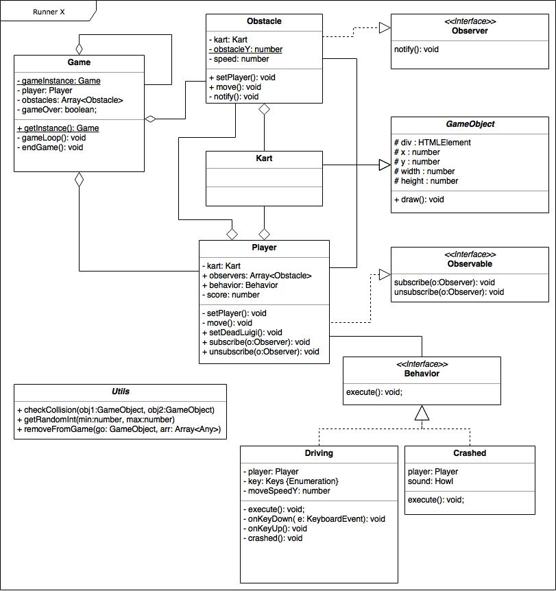

# Runner X

## Game

- Your goal is keep driving and earn points.
- Avoid the obstacles using your arrow keys (Up and Down)

Visit this <a href="https://ohsnapitskenny.github.io/RunnerX/dist/" target="_blank">website</a> to play the game.

## Installation
Do you to download the files and work on it yourself?

Run this code in your terminal: 

`
$ git clone https://github.com/ohsnapitskenny/runnerX
`

### Singleton
This one can be found in `game.ts`
```
class Game {
    private static gameInstance: Game;

    //Get Instance of game or create one (SingleTon)
    public static getInstance() {
        if (!Game.gameInstance) {
            Game.gameInstance = new Game();
        }
        return Game.gameInstance;
    }
}
 
// load game
window.addEventListener("load", function () {
    Game.getInstance();
});
```

### Strategy Pattern
This one can be found in `/behavoir` directory

This is the interface of Behavior
```
interface Behavior {
    player: Player;
    execute(): void;
}
```

There is a driving and crashing behavior. Here is the class Crashed which implements the Behavior interface 
```
///<reference path="behavior.ts"/>

class Crashed implements Behavior {
    
    public player: Player;
     
    constructor(p: Player) {
        this.player = p;
    }

    public execute() {
        ...
    }
}
```

### Observable / Observer Pattern
This one can be found in `/observers` directory
 
You can find two interfaces in this directory. Here are the interfaces Observable & Observer

### Observable interface + Object that implements it
```
interface Observable {
    observers: Array<Observer>;

    subscribe(o: Observer): void;
    unsubscribe(o: Observer): void;
}
```

```
///<reference path="gameobject.ts"/>
///<reference path="../observers/observable.ts"/>
 
class Player extends GameObject implements Observable {
   
    public observers: Array<Obstacle>;
   
    constructor(parent: HTMLElement) {
        super("player", parent, 50, 250, 93, 99);
        this.kart = new Kart(this.div, 100, 250, 93, 99);

        // Initialize Array
        this.observers = new Array();
    }
 
    // Observable methods
    public subscribe(o: Observer): void {
        this.observers.push(o);
    }
 
    public unsubscribe(o: Observer): void {
        let i: number = this.observers.indexOf(o);
        if (i != -1) {
            this.observers.splice(i, 1);
        }
    }
}
```

### Observer interface + Object that implements it
```
interface Observer {
    notify(): void;
}
```

```
///<reference path="gameobject.ts"/>
///<reference path="../observers/observer.ts"/>
 
class Obstacle extends GameObject implements Observer {

    private kart: Kart;

    constructor(parent: HTMLElement, p: Player) {
        // Construct obstacle and add a kart
        super("obstacle", parent, Utils.getRandomInt(1000, 1200), Obstacle.obstacleY, 93, 99);
        this.kart = new Kart(this.div, 10, 0, 93, 99);

    }

    public notify(): void {
        this.div.classList.remove("toad");
        this.div.classList.add("toad_laugh");
        this.setSpeed(0);
    }
}
```

### Game Library (Howler.js)
`howler.js` is an audio library for the modern web. It defaults to Web Audio API and falls back to HTML5 Audio.

```
/// <reference types="howler" />

class Crashed implements Behavior {
 
    private sound: Howl;

    constructor(p: Player) {
        this.player = p;
 
        this.sound = new Howl({
            src:        ['assets/dead.mp3'],
            autoplay:   true,
            loop:       false
        });
}
```


### Others
Besides the three strategy patterns. I've also implemented the following items:
- Encapsulation --> `gameobject.ts`
- Composition --> `game.ts`
- Inheritance --> `player.ts` 
- Classes --> `gameobject.ts`
- Interfaces --> `behavior.ts`
- Abstract --> `gameobject.ts`
- Namespace --> `utils.ts`
- Polymorphism --> `gameobject.ts`
- Enum --> `driving.ts`
 

### UML



## Peer review week 7

### Assessment

- Class diagram: Present and complete, although there are some funny occurances like some stray semicolums, intresting use of aggregations around Obstacle, Kart and Player classes, the chevrons to indicate an interface should be placed around the interface name itself, Utils class appears to be abstract but in reality it is not and missing underline for static methods in the Utils class
- Encapsulation, composition, inheritance & polymorphism: The game is built with various DOM elements that inherit from a gameObject class, which are the appended to other DOM elements
- Singleton: The game class has been turned into a singleton using a private constructor and the getInstance() method interpret the state of the game.
- Observers: Player has been turned into an observable which is observed by the obstacles, notify is correctly used but the subscribe method isn't called where it usually is called which is in the constructor of the observer
- Strategy patterns: The Driving and Crashed classes are implementations of the Behavior interface, they both have their own execute methods
- Interface: The Behavior interface with defines the blueprint for the Driving and Crashed behaviors
- Static: Some examples of static used here are the 3 static methods in the Utils class, which are checkCollision(), removeFromGame() and getRandomInt()
- Namespace: The Utils class has been wrapped into a namespace which separates the static methods in Game and Number sections
- Enumerations: Contains a list of keyboard inputs so they can be called using a custom label to avoid confusion
- Library: The Howler library has been used to add sound to the game, this is done using a js file instead of a ts definition file
- Gameloop: Is correctly being called 60 times per second to update all gameObjects in the game

### Verdict

Game contains all the subjects that we discussed in class, however it could use a clear beginning and end, perhaps using a title and end screen. There is a live page where the game can be played and a library has been implemented into the game.

I deem this project to be sufficient to pass the course.